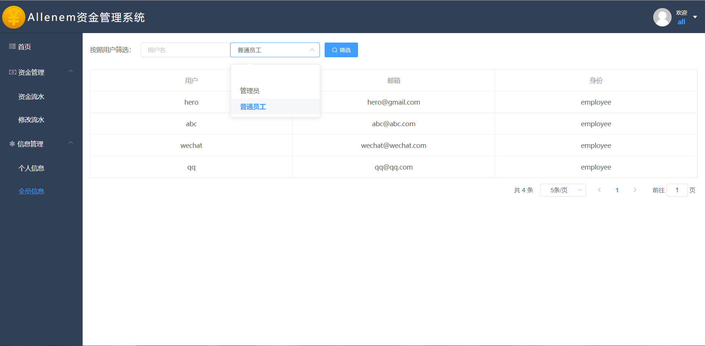

# 资金管理系统（带权限）

## 目录：

[快速开始](#一快速开始)

[文件结构说明](#二文件结构说明)

[功能说明](#三功能说明)

[效果展示](#四效果展示)

[接口说明](#五接口说明)

[(附1)打码过程记录](#附1打码过程记录)

[(附2)视频学习地址](#附2学习地址)

## 一、快速开始

```bash
git clone https://github.com/Allenem/CapitalManagementSystem.git

npm install

npm run client-install

npm run dev
```

服务端地址：http://localhost:5000, 客户端地址：http://localhost:8080

## 二、文件结构说明

### 1.结构树
根目录下打开`cmd`或`powershell`运行`tree /f`命令生成

```
.
│  package-lock.json
│  package.json
│  README.md
│  server.js
│
├─client
│  │  .gitignore
│  │  babel.config.js
│  │  package-lock.json
│  │  package.json
│  │  README.md
│  │  vue.config.js
│  │
│  ├─public
│  │  │  favicon.ico
│  │  │  index.html
│  │  │
│  │  └─css
│  │          reset.css
│  │
│  └─src
│      │  App.vue
│      │  http.js
│      │  main.js
│      │  router.js
│      │  store.js
│      │
│      ├─assets
│      │      403.png
│      │      404.gif
│      │      bg.jpg
│      │      coin.png
│      │      showcase.jpg
│      │
│      ├─components
│      │      Dialog.vue
│      │      HeadNav.vue
│      │      LeftMenu.vue
│      │
│      └─views
│              404.vue
│              ChangeList.vue
│              FundList.vue
│              Home.vue
│              Index.vue
│              InfoShow.vue
│              Login.vue
│              Register.vue
│              UserList.vue
│
├─config
│      keys.js
│      passport.js
│
├─effectImg
│      ……
│
├─models
│      Profile.js
│      User.js
│
└─routers
    └─api
            profiles.js
            users.js
```

### 2.结构说明

#### ①后端文件

主文件

`server.js`

两个模型

`models/Profile.js`

`models/User.js`

路由配置

`routers/api/profiles.js `

`routers/api/users.js `

常量和token验证

`config/key`

`config/passport`


#### ②前端文件

vue默认配置

`client/vue.config.js`

入口文件

`client/public/index.html`

根组件

`client/src/App.vue`

路由配置

`client/src/router.js`

库的引用

`client/src/main.js`

loading，请求拦截，响应拦截

`client/src/http.js`

vuex存储

`client/src/store.js`

静态文件夹

`client/src/assets`

页面文件夹

`client/src/views`

组件文件夹

`client/src/components`


## 三、功能说明

- [x] 后端users接口配置（注册、登录、获取）
- [x] 后端profilss接口配置（查询全部，查询单个，增，改，删）
- [x] 注册页面
- [x] 登录页面
- [x] 主页页面
- [x] 资金流水页面
- [ ] 修改记录页面
- [x] 个人信息页面
- [x] 全员信息页面
- [x] 404页面

## 四、效果展示

**test无身份，all为管理员**

|||
|:-:|:-:|
|注册页|登录页|

|||
|:-:|:-:|
|主页|非管理员资金流水页|

|||
|:-:|:-:|
|非管理员资金流水页筛选|非管理员修改记录|

|||
|:-:|:-:|
|非管理员个人信息页|非管理员全员信息页|

|||
|:-:|:-:|
|管理员资金流水页 5items/page|管理员资金流水页 10items/page|

|||
|:-:|:-:|
|管理员资金流水页编辑|管理员个人信息页|

|||
|:-:|:-:|
|管理员全员信息页|管理员全员信息筛选|

## 五、接口说明

### 用户部分

#### 1.users数据库测试

```json
接口地址：http://localhost:5000/api/users/test
请求方式：get
请求示例：Examples
接口参数：
1.请求参数说明：
{
    
}
2.返回参数说明：
{
  "msg":"users test api works"
}
```

#### 2.用户注册

```json
接口地址：http://localhost:5000/api/users/register
请求方式：post
请求示例：Examples
接口参数：
1.请求参数说明：
{
  "name": "test",
  "email": "test@test.com",
  "password": "123456",
  "identity": "manager"
}
2.返回参数说明：
{
  "name": "test",
  "email": "test@test.com",
  "avatar": "xxx",
  "password": "123456",
  "identity": "manager"
}
```

#### 3.用户登录

```json
接口地址：http://localhost:5000/api/users/login
请求方式：post
请求示例：Examples
接口参数：
返回参数说明：
1.请求参数说明：
{
  "email": "test@test.com", 
  "password": "123456",
}
2.返回参数说明：
{
  "success": true,
  "token": "'Bearer'  + token"
}
```

#### 4.获取当前用户

```json
接口地址：http://localhost:5000/api/users/current
请求方式：get
请求示例：Examples
接口参数：
返回参数说明：
1.请求参数说明：
{
  
}
2.返回参数说明：
{
  "id": "qwertyuiopasdfghjklcvbnm",
  "name": "test",
  "email": "test@test.com",
  "identity": "manager"
}
```

#### 5.获取所有用户信息

```json
接口地址：http://localhost:5000/api/users/
请求方式：get
请求示例：Examples
接口参数：
返回参数说明：
1.请求参数说明：
{
  
}
2.返回参数说明：
{
"user":
[
    {
        "_id": "5d320d3bb77a763724d503d9",
        "name": "test",
        "email": "test@gmail.com",
        "avatar": "//www.gravatar.com/avatar/1aedb8d9dc4751e229a335e371db8058?s=200&r=pg&d=mm",
        "password": "$2b$10$TBjcpQBI2hsXfZMB5DKzXuQBeevJI7mc7GuootkbwscUT9A/wiI6S",
        "date": "2019-07-19T18:34:35.489Z",
        "__v": 0
    },
    {
        "_id": "5d32b28ae6b23dcb8dd4f727",
        "name": "abc",
        "email": "abc@abc.com",
        "avatar": "//www.gravatar.com/avatar/4adcca49b3b1e5a08ac202f5d5a9e688?s=200&r=pg&d=mm",
        "password": "$2b$10$TFjKmx0vtwbDjQMr6R0kNeQ/jQvDLzCksDPXebDBJyykahun7Cnhi",
        "identity": "employee",
        "date": "2019-07-20T06:19:54.158Z",
        "__v": 0
    }
]
}
```

### 资金流水部分


#### 1.profiles数据库测试

```json
接口地址：http://localhost:5000/api/profiles/test
请求方式：get
请求示例：Examples
接口参数：
1.请求参数说明：
{
    
}
2.返回参数说明：
{
  "msg":"profiles test api works"
}
```

#### 2.资金流水添加

```json
接口地址：http://localhost:5000/api/profiles/add
请求方式：post
请求示例：Examples
接口参数：
返回参数说明：
1.请求参数说明：
{
  "type":"优惠券",
  "describe":"买书",
  "income":"30",
  "expend":"20",
  "cash":"10",
  "remark":"开心"
}
2.返回参数说明：
{
  "type":"优惠券",
  "describe":"买书",
  "income":"30",
  "expend":"20",
  "cash":"10",
  "remark":"开心"
}
```

#### 3.资金流水获取全部

```json
接口地址：http://localhost:5000/api/profiles/
请求方式：get
请求示例：Examples
接口参数：
返回参数说明：
1.请求参数说明：
{

}
2.返回参数说明：
{
  "profile":
  [
    {
      "type":"优惠券",
      "describe":"买书",
      "income":"30",
      "expend":"20",
      "cash":"10",
      "remark":"开心"
    },
    {
      "type":"礼券",
      "describe":"充值",
      "income":"50",
      "expend":"20",
      "cash":"30",
      "remark":"好开心"
    }
  ]
}
```

#### 4.资金流水获取单个

```json
接口地址：http://localhost:5000/api/profiles/id
请求方式：get
请求示例：Examples
接口参数：
返回参数说明：
1.请求参数说明：
{
  "id":"5d320d3bb77a763724d503d9"
}
2.返回参数说明：
{
  "_id":"5d320d3bb77a763724d503d9",
  "type":"优惠券",
  "describe":"买书",
  "income":"30",
  "expend":"20",
  "cash":"10",
  "remark":"开心"
}
```

#### 5.资金流水编辑

```json
接口地址：http://localhost:5000/api/profiles/edit/id
请求方式：post
请求示例：Examples
接口参数：
返回参数说明：
1.请求参数说明：
{
  "type":"优惠券",
  "describe":"买书",
  "income":"30",
  "expend":"20",
  "cash":"10",
  "remark":"开心"
}
2.返回参数说明：
{
  "type":"优惠券",
  "describe":"买书",
  "income":"30",
  "expend":"20",
  "cash":"10",
  "remark":"开心"
}
```

#### 6.资金流水删除

```json
接口地址：http://localhost:5000/api/profiles/delete/id
请求方式：delete
请求示例：Examples
接口参数：
返回参数说明：
1.请求参数说明：
{
  "id":"5d320d3bb77a763724d503d9"
}
2.返回参数说明：
{
  "_id":"5d320d3bb77a763724d503d9",
  "type":"优惠券",
  "describe":"买书",
  "income":"30",
  "expend":"20",
  "cash":"10",
  "remark":"开心"
}
//已删除的信息
```

## （附1）打码过程记录

### 1.后端接口配置（nodejs, express)

`npm install nodemon -g` 全局安装nodemon避免重复启动服务器

`npm i mongoose` 安装mangooose

[MongoDB Atlas](https://cloud.mongodb.com) 官网免费注册申请 MongoDB Atlas 云数据库

[postman](https://www.getpostman.com/downloads/) 下载安装软件进行接口测试

`npm i body-parser` 安装body-parser发post请求

`npm i bcrypt` 加密

`npm i gravatar` 头像，可到https://en.gravatar.com/注册上传头像

`npm i jsonwebtoken` 登录成功返回token，token可以理解为一个令牌或者一个钥匙

`npm install passport-jwt passport` 验证token


### 2.前端页面书写（vue-cli 3.9.3, element-ui)

`npm install -g @vue/cli-service-global` 全局安装最新的vue-cli

总文件目录下运行 `npm i concurrently` 前后端连载，不用分步开启服务，配置如下：

配置前端 `client/package.json` 的 `"scripts"`
```json
  "scripts": {
    "serve": "vue-cli-service serve",
    "build": "vue-cli-service build",
    "start": "npm run serve"
  },
```
配置总文件 `package.json` 的 `"scripts"`
```json
  "scripts": {
    "client-install": "npm install --prefix client",
    "client": "npm start --prefix client",
    "start": "node server.js",
    "server": "nodemon server.js",
    "dev": "concurrently \"npm run server\" \"npm run client\""
  },
```
总文件目录下运行 `npm run dev` 实现前后端服务同时开启

`npm i jwt-decode -S` 解析token模块

`npm i axios -S` 请求工具axios

`npm i element-ui -S` 安装element-ui组件

用到其 
* Message 消息提示
* Loading 加载
* NavMenu 导航菜单
* Table 表格
* Form 表单
* Pagination 分页
* DateTimePicker 日期时间选择器
* Icon 图标
* MessageBox 弹框 

等等

引入 `font-awesome` 图库
```html
<link href="//cdn.bootcss.com/font-awesome/4.7.0/css/font-awesome.css" rel="stylesheet">

<!-- 示例 -->
<i class="fa fa-margin fa-server fa-2x"></i>
```

## （附2）学习地址
腾讯课堂：https://ke.qq.com/course/391846

网易课堂：https://study.163.com/course/introduction/1209227821.htm

B站地址：

https://www.bilibili.com/video/av59056478，
https://www.bilibili.com/video/av55896464，
https://www.bilibili.com/video/av53141006，
https://www.bilibili.com/video/av54125678，
https://www.bilibili.com/video/av44940777
